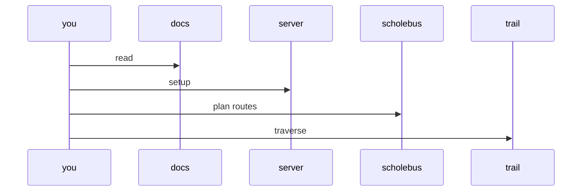

# schole-bus
Scholé Bus is a POI map-centric application geared toward Road-Trippin' Home Educators

Part of the fun is preparing for the trip, and what better way to prepare then to build a website with a backing spatial database before plotting some waypoints!

Features including
* Extracting road and trail segments from Open Street Map
* Routing between waypoints
* Integration with Point of Interest and Geolocating services

Let the adventure begin!

* [Application Design Overview](./app/docs/overview.md)
* [Server Setup](./app/docs/overview.md)
* [Database Setup](./app/docs/setup.md)
* [Routing Setup](todo)